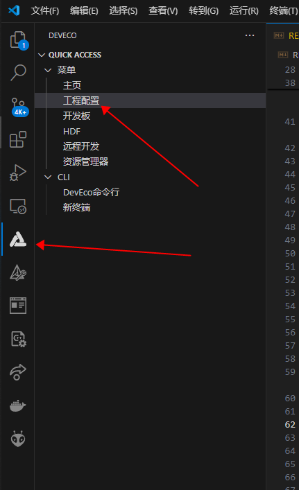

# 简介

Ai-BS21-SDK 是为Ai-BS21 星闪模组开源的SDK，SDK采用半开源的方式，用户可以使用本SDK开发自己的应用，如需开放所有代码，请联系安信可官方：<https://www.ai-thinker.com/>

>**温馨提示：**
>此Ai-BS21-SDK 只适用于安信可Ai-BS21系列模组或开发板
>

# SDK 架构


# 目录结构

| 文件夹| 描述 | 备注 |
| :-----------: | :---: | :---: |
| application   | 外设驱动示例代码、demo | 开源|
| build         | 编译脚本              | /   |
| doc           | 直到文档和图片        | /    |
| drivers       | 驱动库               | 闭源 |
| include       | 驱动库接口            | /   |
| interim_binary| boot bin文件         | 闭源 |
| kernel        | 系统内核             | 闭源 |
| middleware    | 中间件               | 闭源 |
| open_source   | 开源组件             | 开源 |
| output        | 固件输出文件夹        |/    |
| protocol      | 协议                 | 闭源 |
| test          | 测试工程             | 开源 |
| tools         | 编译工具等           |/     |
| vendor        | 芯片架构             |/    |

# 环境搭建

官方推荐使用Windows平台来搭建开发环境。

## VScode 下载

Visual Studio Code 检测VScode,是一个开源的、免费的代码编辑软件，建议前去官方网站下载最新版本的VScode:**<https://code.visualstudio.com/>**


## DevEco Device Tool 安装

DevEco Device Tool 是芯片厂商对VScode 进行适配的IDE，可以对BS21、BS25等芯片进行开发和编译烧录。
下载地址（**提取码：BS21**）：[开发工具集合:BS21_Software.zip](https://pan.baidu.com/s/1BZa2AHsjZJsLSeQPPeGDfA)
下载之后，`双击`*deveco-device-tool-all-in-one-CFBB-1.1.5-beta.exe*便可以进行安装了,安装的过程和其他软件的安装方法一致。
>注意这个提示:
显示 **“Python 3.8-3.9”和“VScode 1.66.2+”** 状态都是 "OK"的，不然无法安装，这个是否需要根据提示安装相应的工具。


安装完成之后，**重新打开VScode** 便能看到导航栏的 DevEvo 插件：


> **注意:**
> 提示更新的话，请不要更新版本，否则会出现找不到编译按钮的情况

## SDK 克隆

### Github

```
git clone https://github.com/Ai-Thinker-Open/Ai-BS21_SDK.git
```

### Gitee

```
git clone https://gitee.com/Ai-Thinker-Open/Ai-BS21_SDK.git
```

## SDK 导入IDE

打开IDE的主页，点击右侧的`导入工程`按钮：


找到克隆完成的*Ai-BS21_SDK* 文件夹，点击`导入`：


首次导入需要选择芯片和开发板，芯片选择:***BS21-N1100E***,开发板保持默认：


## 编译工具安装

DevEco IDE 没有固定的编译工具，所以需要自行添加编译工具。

### DevTools_CFBB 工具下载

CFBB 工具是一个通用的工具，它可以对BS21、BS25的程序进行编译，点击下载并解压（**提取码：BS21**）：[开发工具集合:BS21_Software.zip](https://pan.baidu.com/s/1BZa2AHsjZJsLSeQPPeGDfA)

### 配置编译工具

打开`DevEco`中的工程配置：



在`工程配置` 中找到*compiler_bin_path*选项，在然后找到的文件夹“DevTools_CFBB_V1.0.7”：


#### 例如


## 编译demo

成功导入之后，在IDE的下方会出现编译快捷指令：


### 指令说明

| 名称          | 功能          |
| :---:         | :---:        |
|Build          | 编译         |
|Clean          | 清除编译结果  |
|Rebuild        | 重新编译      |
|Upload         | 下载程序      |
|Stack  Analysis| 堆栈分析      |
|Image Analysis | 内存分析      |
|KConfig        | 外设example 配置|

>提示:
> 首次导入工程，建议先执行一下：**Clean**

点击`Build`即可执行编译指令，编译成功示例：


## 烧录程序

### 配置烧录端口

在`工程配置`页面选择烧录选项中的`upload_port`,选择相应的串口：


### 烧录

在IDE 中，点击`Upload`指令，便能启动下载程序，在终端中看到 **"Connecting, please reset device..."**的输出后，复位Ai-BS2-32S模组（开发板按一下复位键），就能开始下载程序。


>**提示：**
>如果出现长时间未出现下载进度条，请重新拔插串口烧录工具或开发板
